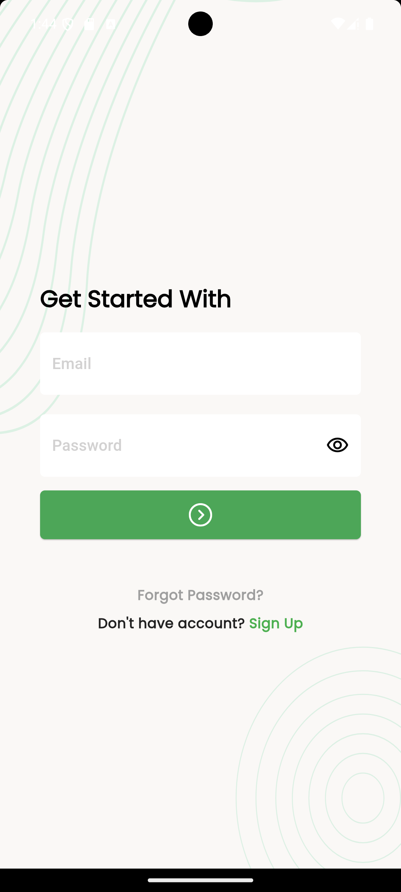
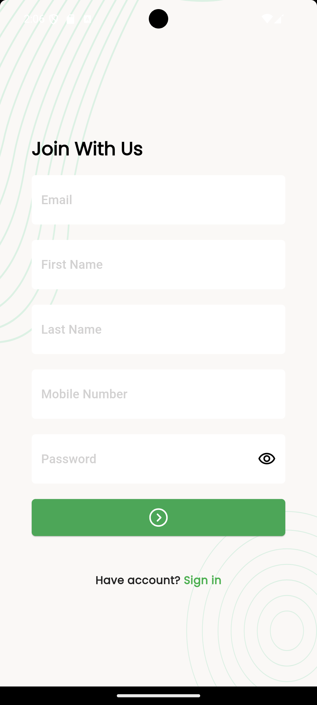
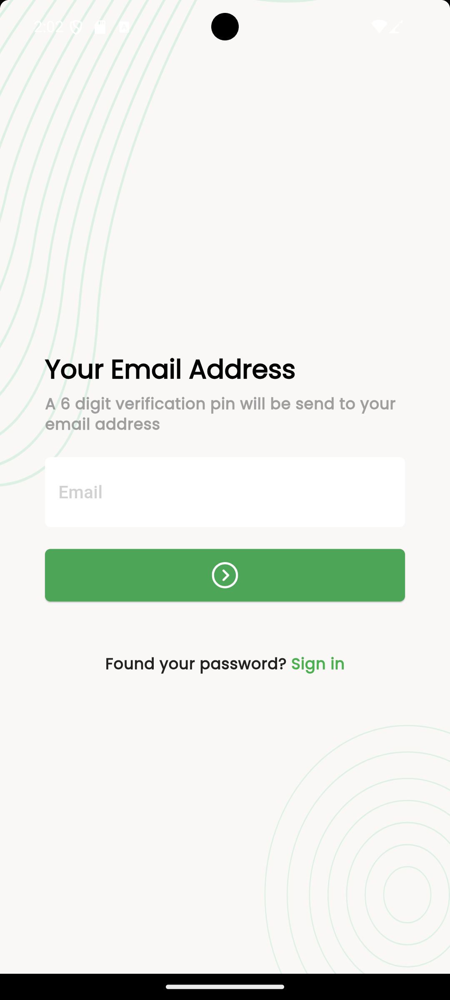
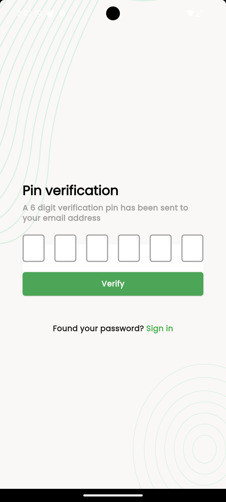
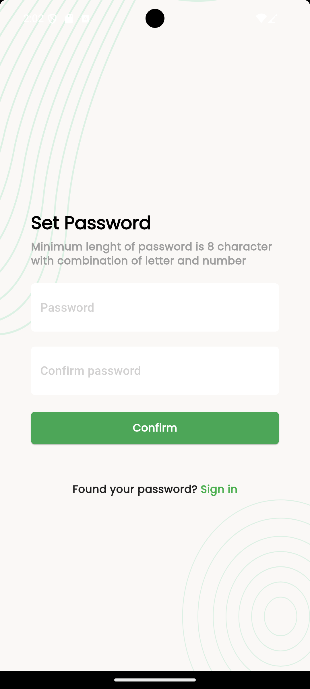
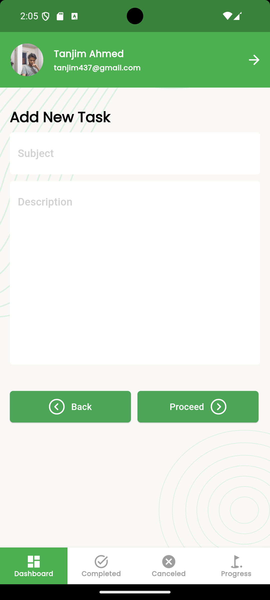
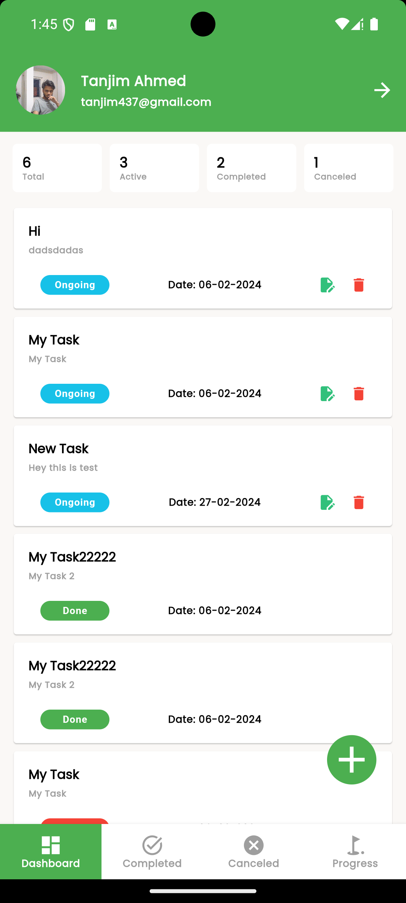
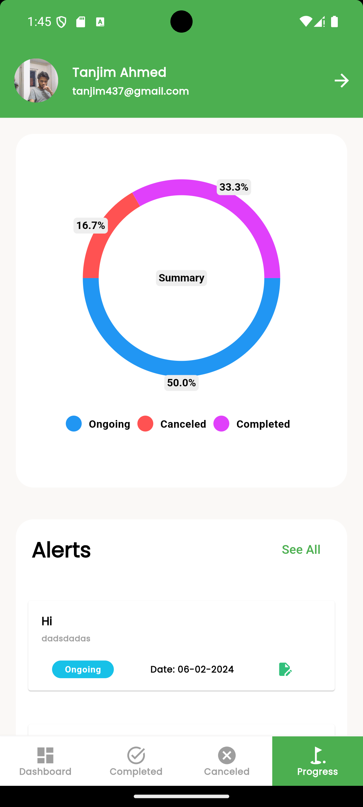
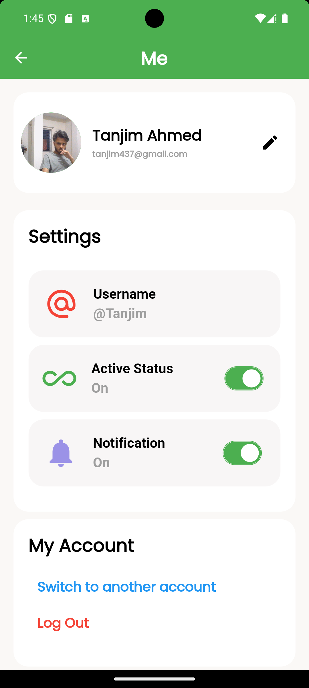
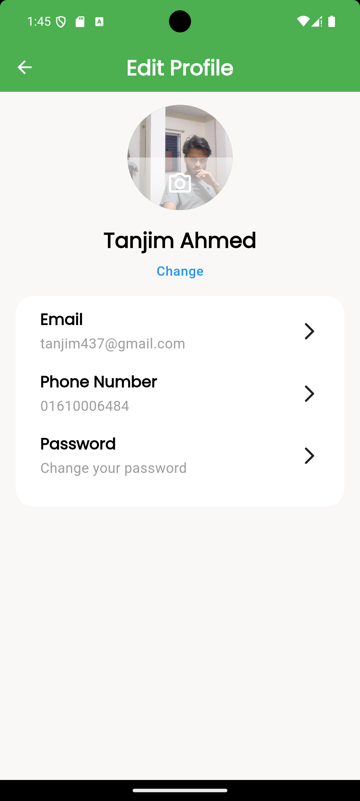

<p align="center" ></p>

# Reddit Clone

Responsive Task Manager App using Flutter and GetX 

## Features
- Token Authentication
- Rest Api with token
- Shared Preference
- Caching
- GetX state management
- Base64image uploading
- CRUD using REST api
## YouTube

I have put video about all my project here [WittyWidget](https://www.youtube.com/@wittywidgets)

<h2>🚀 App Preview</h2>

 [](https://youtu.be/NirF4Id3-G4)

[Watch the Video](https://youtu.be/NirF4Id3-G4)

## Project Screenshots
              


## Installation

After cloning this repository, migrate to `Task-Manager` folder. Then, follow the following steps:

  Then run the following commands to run your app:

```bash
  flutter pub get
  flutter run
```

## Tech Used

**Data Handling**:Shared Preference, REST api provided by @ostad

**Client**: Flutter, GetX

## Feedback

If you have any feedback, please reach out to me at tanjim437@gmail.com

